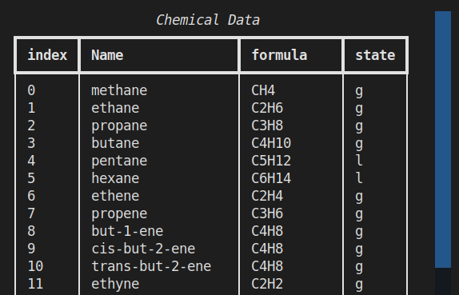
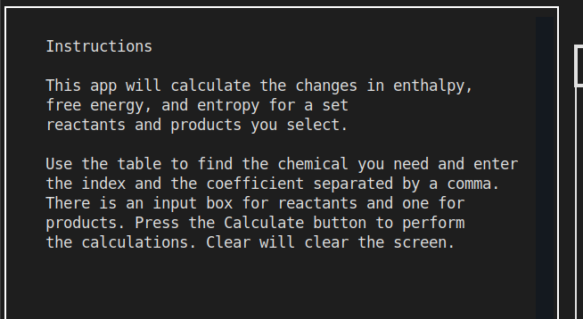
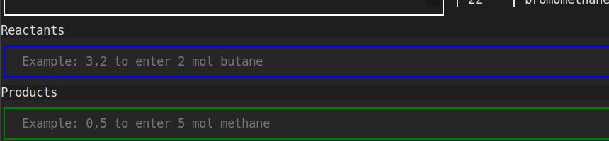
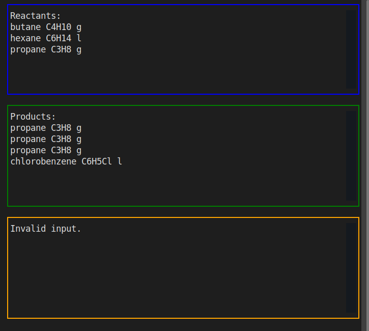
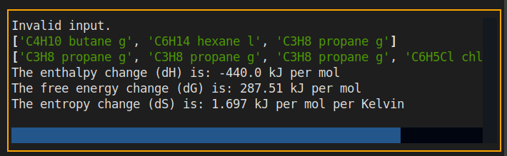

# Introduction
Thermodynamic calculations are a part of every introductory high school chemistry class. Specifically, there are three 
quantities students are expected to calculate:
* Enthalpy Change (dH) - This is the change in the total heat content of a system as reactants are converted into 
products in a chemical reaction.
* Free Energy Change (dG) - Also called the Gibbs free energy change, this is a measure of the amount of useful work 
either absorbed or released from the system during a chemical reaction.
* Entropy (dS) - This is a measure of the change in entropy in a chemical reaction as products are formed from reactions. Entropy is 
quantity that measures how much useful energy is unavailable for useful work (per unit temperature). 

The process by which the student calculates these quantities involves the following general steps:
1. The student must have a balanced chemical equation
2. The student must then look up the thermodynamic value for each chemical in the equation in a table. 
3. For reactants (these are on the left side of the reaction arrow), the student multiplies the coefficient of the chemical 
in the equation by the value of the thermodynamic quantity found in the table. This is repeated for the all the
reactants and products.
4. The energies the reactants are added. The energies of the products are added.
5. The change is determined by subtracting reactants from the products.
   - sum of products - sum of reactants [//]:#(Add LaTex formula) 
   - $$\sqrt{x]$$

This process is tedious and error-prone since students often misread data in the table, or make calculator mistakes as
they perform sums, and often confuse products with reactants.

My console app helps students perform these calculations. Students enter the reactants and products from
a data table (provided in the app) along with the coefficients from the balanced chemical equation and the values
of dH, dG, and dS are calculated and displayed neatly.

# User Stories
As a User I want to 
* Navigate the sections of the app with keyboard or mouse.
* Have the chemical data visible to me in the app.
* Scroll through the chemical data easily
* easily enter chemical quantities and formulas
* easily distinguish between products and reactants
* be aware of which chemicals I have selected
* clear my entries if I make a mistake
* have instructions readily available so I know what to do
* be given hints as to how to properly enter data
* be notified when I make an improper entry. I should not have to restart from the beginning if I make a mistake
* Have the results of the calculation clearly displayed and neatly formatted

# UI Design
## Features
### Scrollable Data Table
A table displaying a list of all the chemicals available is shown at the center of the screen. The energy values
are not displayed to keep the screen compact and to enhance readability. After all, the purpose of the app is to
avoid having to work with the values directly. The user can scroll with a mouse or the arrow keys.

> Have the chemical data visible to me in the app.  
> Scroll through the chemical data easily  
> Navigate the sections of the app with keyboard or mouse.

### Instruction Section
There is a pane with a short description of how to use the app. It is easily visible and the content scrolls
if the screen is too small.

> have instructions readily available, so I know what to do  
> Navigate the sections of the app with keyboard or mouse.  

### Input Widgets
The user can enter input to select reactants and products by entering data into these two form input widgets. When the user hits 
Enter or clicks on the button with the mouse, the data is queried and the reactants and products are displayed in the 
respective output window. There is a hint to the user as to how to enter input correctly. The reactants and products are labelled
and color coded with different borders.

> easily distinguish between products and reactants  
> be given hints as to how to properly enter data
> Navigate the sections of the app with keyboard or mouse.
### Output Panel
The output panel features three boxes. Two are labelled for reactants and products. The third is for output.
The borders of the reactant/product boxes match those of the input fields. If the user enters incorrect
input, they are notified in the third box. These windows will automatically have scrollbars if content goes 
offscreen. However, most chemical equations (especially those at an introductory level) rarely have more than two or
three products and reactants. Thus, for the vast majority of use cases, the content a user would enter will fit
on the screen.

> easily distinguish between products and reactants  
> be aware of which chemicals I have selected  
> be notified when I make an improper entry. I should not have to restart from the beginning if I make a mistake

### Calculation Report
When the user clicks on or presses enter on the Calculate button, the chemicals selected as products
and reactants are used to perform a series of calculations using data in the dataframe. The results
are formatted and outputted to the output panel. In addition to the output values, the user is given 
a list of the reactants and products used. This is to help them ensure that the calculations are based on
the values they entered.

> Have the results of the calculation clearly displayed and neatly formatted  
> be aware of which chemicals I have selected  
> Navigate the sections of the app with keyboard or mouse.

### Action Buttons
There are two buttons. One labelled Calculate and the other Clear. When the user clicks on or presses enter
on the Calculate button, the calculations are executed and the results displayed. When the user presses or 
clicks on the Clear button, the input is cleared as is the text boxes for reactants and products.

> clear my entries if I make a mistake  
> Navigate the sections of the app with keyboard or mouse.
## Algorithm Design
This sections outlines the more important algorithms in the app using pseudocode. Trivial algorithms or those
achieved mainly through libraries are not mentioned.
### Creation of Data Table
This is the algorithm design for the creation of the datatable. It involves loading a dataframe (which is done using
the pandas library), creating a Table object from the Rich library, looping over the rows in the dataframe to add
the data from the rows to the Table. That table object is then written to the correct TextLog in the UI.
```
GET reference to dataframe
INITIALIZE Table object
   INITALIZE Column for Index, Name, Formula, State
LOOP over each row in the dataframe
   FOR each row in the dataframe
      retrieve index
      retrieve name
      retrieve formula
      retrieve state
      add these values to row in Table object
GET reference to TextLog widget
on widget mount to window:
   print table object to log
```
### Handling and Validation of User Input
This logic is handled by the _on_input_submitted() method which is part of the Textual library. This method
is called whenever the user hits the enter key on an Input object. The method is passed an Input.Submitted object
which contains data about the object and data submitted.
```
#Determine which input object was submitted
   GET message.id value
      IF input.id is reactant_input
         check if input is valid
         if valid
            retrieve data from dataframe
            add it to the list of reactants
            print the value to the reactant output window
         if not valid
            print error message to output log
      IF input.id is product_input
         check if input is valid
         if valid
            retrieve data from dataframe
            add it to the list of products
            print the value to the product output window
         if not valid
            print error message to output log
```
This is the logic employed to determine whether the input is valid. Two things need to be checked, the first
is whether the input is in the form of integer,integer. The second is whether the first integer, which 
is the index of the chemical is within range. In other words, if the user enters -5 for an index or 65 (which does not
exist), the input should be flagged as invalid. The method accepts the user_input as a parameter.
```
#Method to determine if user input matches pattenrn integer,integer using regex

initialize regex pattern [0-9]+,[1-9]+ #any number of digits,any number of digits
compare user input to regex expression
   if match
      return TRUE
   else 
      return FALSE
```
This is the logic to determine if the input index is within range. It will only be called if the input pattern
matches the requirment of being in the form integer,integer.
```
#split the user input into an array of two
split_string_aray = user_input.split(",")
index = split_string_array[0] #The first value is supposed to be the index
   if index < 0 OR index > dataframe size
      return FALSE
   else
      return TRUE
```
### Querying Data
The logic for retrieving data from a dataframe object is simple. One simply calls the _get_value() method on
the dataframe object and pass in the index of the row and name of the column as a string. 
### Event Handling
The Textual libraries built in widgets have a set of event handlers to respond to user events such as clicks, input
submission, and text changes. This is the logic that is executed by the library's on_button_pressed() method which
is called any time a user clicks on a button object with the mouse or presses the Enter key while a button object
has focus. The method is passed a Button.Pressed object which encapsulates information about the button that was clicked.
```
#Get the id value from the clicked button
if button.id == 'submit button'
   execute chemical calculations
if button.id == 'clear button'
   reset the value of products list
   reset the value of reactants list
   clear the reacts window
   clear the prodcuts window

```
### Calculation of Quantities
This is the key algorithm in the app as it is responsible for producing the output that the user needs. The
general steps in the calculation of quantities and the production of hte output are as follows:
1. calculate the dH, dG, and dS
2. retrieve the formulas for the products
3. retrieve the formulas for the reactants
4. output the values

This is the algorithm for calculating dH, dG, and dS. The logic is the same for each. The method accepts a dataframe,
a list of products, and a list of reactants as input. The only thing that changes is the name of column from which
we want to retrieve data.
```
#We want to retrieve values from the dH column.
column = 'dH' 
sum_products = 0
sum_reactants = 0
   #loop over the reactants
   for each reactant in reactants:
      retrieve its energy value from dataframe column
      add that value to the sum_reactants
   
   #loop over products
   for each product in products
      retrieve its energy value from the dataframe column
      add that value to sum_products
   
   return sum_products - sum_reactants
```

This is the logic for producing the output:
```
calculate dH
calculate dG
calculate dS

product_formula_list
reactant_formula_list

#Retrieve the formulas for the reactants
   #Loop over the reactants list
   for each reactant in reactants list
      retrieve formula from dataframe using index in reactant_formula_list
      store that formula in a list
   #Loop over the products list
      rerieve fromula from dataframe using index in product
      store that formula in a product_formula_list

   write reactant_formula_list to output window
   write product_formula_list to output window
   
   write dH as formatted string with units to output window
   write dG as formatted string with units to output window
   write dS as formatted string with units to output window
```
# Testing
Although unit testing is ideal, this app used many libraries which themselves have been tested. The methods that were
developed to perform the chemical calculations are simple enough to be tested manually.
## Manual testing
| Test Description                               | Test                                                                                                                                                                                                                                | Result |
|------------------------------------------------|-------------------------------------------------------------------------------------------------------------------------------------------------------------------------------------------------------------------------------------|--------|
| Instructions are visible                       | When the app is run<br> Then the instructions are clearly visible in the left panel.                                                                                                                                                | PASS   |
| Chemical data is readily available             | When the app is run <br> Then the chemical data table is loaded <br> The table is scrollable with mouse or keyboard <br> It is in the center panel                                                                                  | PASS   |
| Products appear in the product panel           | When the user provides correct input in the product input field <br> The product appears in the product window.                                                                                                                     | PASS   |
| Reactants appear in the product panel          | When the user provides correct input in the reactant input field <br> The reactant appears in the product window.                                                                                                                   | PASS   |
| The Clear button functions                     | When the user clicks on the Clear button <br>The products, reactants, and output window are cleared.                                                                                                                                | PASS   |
| The Calculate button functions                 | When the user enters valid data for products and reactants<br>and clicks on the Calculate button <br> The result of the calculation is displayed in the output window.                                                              | PASS   |
| Invalid input is handled gracefully            | When the user enters anything not in the form of number,number <br> in either the product or reactant input field <br> then the user is notified with a message in the output panel. <br> The input is cleared from the input field | PASS   |
| Invalid index values are gracefully handled    | When the user enters a negative number for the index <br> then an error message is displayed in the output <br> and the input is cleared                                                                                            | PASS   |
| The input fields are cleared after entry       | When the user enters input (valid or not) <br> and then presses enter  <br> The input is cleared from the input field.                                                                                                              | PASS   |
| The results are displayed in the output window | When the user enters valid input <br> and presses the calculate button  <br> The results of the calculation are showed in the output window.                                                                                        | PASS   |
| The results are neatly formatted               | When the results are displayed in the output panel <br> The selected products are printed on one new line. <br> The selected reactants are printed on one new line.                                                                 | PASS   |
| The results are neatly formatted               | When the results are displayed in the output panel <br> The result of the calculation for dH, dG, and dS are shown.<br>Each is on a separate line.                                                                                  | PASS   |
| The results are neatly formatted               | When the results are displayed in the output panel <br> The units for each quantity of dH, dG, and dS are shown.                                                                                                                    | PASS   |
| The calculations are accurate                  | When the user enters valid input <br> and presses the Calculate button <br> the output value for dH, dG, and dS are correct                                                                                                         | PASS   |
# Features left to implement
The following features would be a good additions to the app:
+ Validation of chemical input. As of now, the app calculates the quantities based on what the user enters. However, if 
the user enters a set of products and reactants that do not constitute a valid chemical reaction, the program will perform these calculations
regardless even though the values will not have physical meaning. This is similar to the student incorrectly entering digits and operations on
a calculator - the machine simply performs the calculations based on the input. The user must evaluate the reasonableness of the output themselves.
+ Entering data directly from the table. It would be nice if the user could simply highlight the chemical in the table and either
by hitting enter or some other key add it to the list of products or reactants. The Table object in the Rich library does have
responsive elements. However, the requirement of quantities in addition to the chemical requires a non-trivial handling of user keyboard input.

# Technology Used
+ [PyCharm IDE](https://www.jetbrains.com/pycharm/) An IDE designed specifically for Python developers. This is developed
by JetBrains.
+ [Google Sheets](https://www.google.com/sheets/about/) This online spreadsheet was used to organize the chemical data
into rows and columns that could easily be exported into CSV (comma separated value) text format which can be 
easily loaded in Python.

## Python Libraries
The Python community is quite large and as a result, there are numerous libraries (almost all freely available) that 
help make a developer's life much easier. The following libraries were used in this project.

+ [Rich](https://rich.readthedocs.io/en/stable/introduction.html) is a Python library for displaying rich text
in the console. The table for the chemical data was created with Rich.
+ [Textualize](https://www.textualize.io/) is a library to make beautiful console applications. The library features
many built in widgets such as loggers, buttons, form inputs, etc. that are ready to use with built-in event handlers. 
This library also has a layout and styling mechanism that is based on CSS that makes placing and styling the widgets
relatively easy.
+ [pandas](https://pandas.pydata.org/) This python library is used by data scientists to display, query, and manipulate 
large sets of data. The data in this project is accessed and queried as a pandas dataframe.

# Deployment
## Project Creation
* The project was started by navigating to the [template](https://github.com/Code-Institute-Org/gitpod-full-template) and clicking 'Use this template'. Under Repository name I input ci-project-3. I then navigated to the new [repository for project 3](https://github.com/tony-albanese/ci-project-3). 
* I then cloned the repository into PyCharm by doing the following:
  * Open PyCharm
  * Click on the "Get from VCS" button
  * Copied the [clone url](https://github.com/tony-albanese/ci-project-3.git) for the repository
  * Selected an empty project folder
  * Clicked on the Clone button at the bottom of the dialog
## Heroku
# Version Control Strategy
Git was employed in this project and the project code hosted on [GitHub](https://github.com/). I used branches in order to keep the main branch as "pure" as possible. The strategy was to have each branch dedicated to one feature or fix.  Once I was satisfied at a particular stage of a branch, I would navigate to GitHub, click on my repository, select the branch, and create a pull request. GitHub would then check if there are no conflicts and indicate if the branch could be merged into main. (One can choose which branch to merge into.) Once the pull request is created, I navigated down, wrote a comment, and clicked on the green Merge button and the commits would be merged into the main branch.
I tried to keep commits as atomic as possible - focusing only on one element or feature at a time. This was not always the case, but most of the commits are relatively small changes.
## VCS in PyCharm
To make a commit, I clicked the Git menu item in PyCharm, followed by Commit. In the side panel, I selected the files I wished to commit.
I then typed a commit message and pressed the Commit button in the lower left corner of the panel.
To push to GitHub, I clicked on the Git menu item in PyCharm and then selected Push

# Credits
The chemical data was taken from the [International Baccalaureate](https://www.ibo.org/)'s Chemistry Data Booklet. 